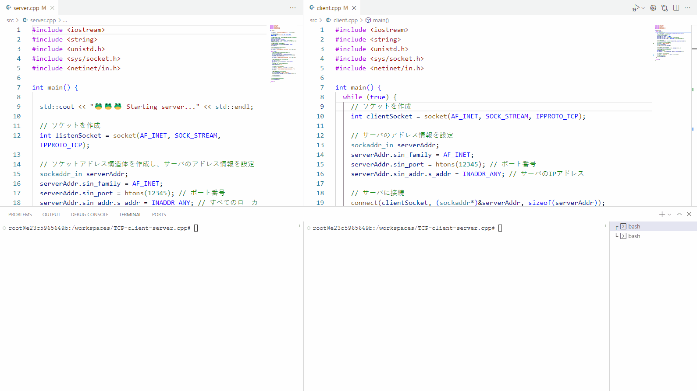

# TCP-client-server.cpp

🔥🔥🔥 C++でTCPクライアントとサーバ間での通信を行ってみる。  

  

## 実行方法

DevContainerを使用してDockerコンテナ内に入り、以下のコマンドを実行。  

```shell
# サーバのビルド・実行
make server && make server-run

# クライアントのビルド・実行
make client && make client-run
```

サーバを実行してから、クライアントを実行する！  
